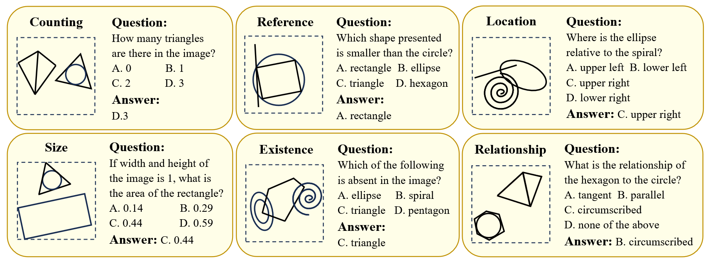
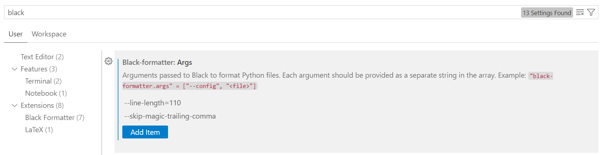

# Introduction

geometric perception evaluation / enhancement & detailed fossil caption

## Install

Requirements are provided in `deploy/requirements.txt`. It's recommended to use python 3.10+.

## Running a module

A `./run` is provided for running a module. Examples:

```shell
chmod +x run

# run the file: default entry is main(); no argument is expected
./run -m data.rule.generate --num_basic_geo_samples 10

# you can also specify the entry function (--action); no argument is expected
./run -m data.format --action to_llava

# If you ensure that `if __name__ == '__main__': main()` is present in the file
# You can also run the file directly via python
python -m data.rule.generate --num_basic_geo_samples 10
```

# GePBench

GePBench is a large-scale, highly customizable multimodal benchmark on geometric perception, targeting at core visual perception capabilities such as spatial awareness and fine-grained visual perception. The benchmark is in VQA format, covering 6 aspects and categorized into easy and hard split. An example of each category:



## Evaluation on Test Set

### Test Data

We provide a standard open test set on [TODO]. Please download and unzip to `./dataset`. `tree dataset --filelimit 10` should result in this:

```
dataset
├── figures  [xxx entries exceeds filelimit, not opening dir]
├── vqa-easy
│   ├── counting.jsonl
│   ├── existence.jsonl
│   ├── location.jsonl
│   ├── reference.jsonl
│   ├── relation.jsonl
│   └── size.jsonl
└── vqa-hard
    ├── counting.jsonl
    ├── existence.jsonl
    ├── location.jsonl
    ├── reference.jsonl
    ├── relation.jsonl
    └── size.jsonl
```

### Supported Models

[TODO] add detailed instruction

Our officially supported models can be found in `./common/vllm`. Please download the corresponding checkpoints from huggingface and save them in `./models` with the same directory name as the python module (extension excluded). You can download them via

```shell
huggingface-cli download org_name/{model_name}-{model_size} --local-dir models/{model_name}-{model_size}
```

After obtaining all the checkpoints, start evaluation with

```shell
scripts/eval/bench.sh --eval_model {model_name}-{model_size} --eval_batchsize {batchsize}
```

The evaluation results will be saved in `results/{model_name}-{model_size}`.

### Evaluate on Custom Models

The easiest way is to create a file `common/vllm/model_name.py`, write a class `GenerateModel` inherited from `common/vllm/base.py: GenerateModelBase`, and implement the its `__init__` and `generate` method. Please read the base class [common/vllm/base.py](common/vllm/base.py) first and refer to the LLaVA-1.5 model [common/vllm/llava.py](common/vllm/llava.py) as an example. After that, your model become one of the supported models and can be used in the same way as the officially supported models.

Another option is to perform your own generation process before calculating the accuracy by referring to [eval/gepbench.py](eval/gepbench.py) which implements the evaluation process. Temperature should be set to 0.0 and do_sample should be set to False.

## Constructing Training Set

To construct the large-scale training set, just run the following command:

```shell
scripts/data/generate.sh train
```

Of course, you can also generate your own test set in the same way. The only difference is the number of samples.

The following is a description on the three phases and corresponding parameters for constructing the data. Please read it for customizing the data generation process.

### Structured textual description

Running the following command can generate rules for geometric shapes in `dataset/rules.json`:

```shell
scripts/data/rule-{easy/hard}.sh
```

You can control the generation process with the following arguments:

- min_num_shapes: the minimum number of shapes in each sample. Default is 2
- num_samples_per_num_shapes: a list for setting `num_samples` for each `num_shapes`. The number of samples with `num_shapes=min_num_shapes + i` is `num_samples_per_num_shapes[i]`.

there are some arguments for controling the numerical characteristics of geometric shapes:

- in_canvas_area_thres: the area threshold for shapes in the canvas, between 0 and 1. A value of 1 means the entire shape has to be fully contained within the canvas. Default is 0.8

- polygon_points_min_distance: the minimum distance between any two points of a polygon. Default is 0.01
- rectangle_ratio_thres: the aspect ratio constraints of rectangle, where the two items in the list represent the lower bound and upper bound respectively. Default is [1.5, 3.0]
- general_quadrilateral_angle_thres: the minimun angular difference between the angle of a general quadrilateral and &pi; / 2
- general_triangle_angle_thres: the minimun angular difference between the angle of a general triangle and &pi; / 3
- line_min/max_length: control the min/max length of line(segment). Default is 0.2/0.5
- ellipse_ratio_thres: the aspect ratio constraints of ellipse, where the two items in the list represent the lower bound and upper bound respectively. Default is [1.5, 3.0]

and there are arguments for controling the proportion of different shapes and relations, for example:

- polygon_shape_level: the proportion of polygon in all shapes
- line_shape_level: the proportion of line in all shapes
- ...
- polygon_tangent_line_level: the proportion of generating a tangent line in all polygon relations
- polygon_shared_edge_level: the proportion of generating a new polygon that have a shared edge with a given polygon
- ellipse_concentric_level: the proportion of generating a set of ellipses that is concentric with a given ellipse
- ...

Each 'level' argument is an integer (with a default value) representing the relative level within its shape/relation block. For more details, please refer to `RuleArgs` in `common/args.py`. All 'level' arguments will be transformed into probabilities using L1 normalization (sum normalization).

For example, if more ellipse is expected, you can set a higher level for ellipse_shape_level:

```shell
./run -m data.rule.generate --polygon_shape_level 1 --line_shape_level 1 --ellipse_shape_level 3 --spiral_shape_level 1
```

For the output, each data sample contains two parts:

- **shapes**: parameters and special information of each geometric shape.
- **relations**: relationship between two shapes in form of `[head_shape_idx, tail_shape_idx, relation_type]`

Example output format:

```json
{
  "shapes": [
    {
      "type": "line"
      //...
    },
    {
      "type": "ellipse"
      //...
    }
  ],
  "relations": [[0, 1, "tangent line"]]
}
```

### Figure Rendering

To simply generate figures with default settings, use the following command:

```shell
scripts/data/draw-{easy/hard}.sh
```

<!-- Two python files, `pil_backend.py` and `plt_backend.py` is provided, in which the former one is written in pillow, providing continuous change of shape, and a relatively less noisy image; the latter, in comparison, provides hand-drawing line style and more natural noise. `plt_backend.py` is recommended to use and `draw.py` will automatically use this version. You can change the preferred version by setting argument `backend` to `plt` or `pil`. -->

<!-- To use `plt_backend.py`, the following arguments are expected: -->

Or you may want to look at the following arguments:

- rules: "list[dict[str, Any]]". Mandatory. The rules you would like to draw.
- random_seed: int|None. The default value is None. Control the random seed.
- randomize: bool. The default value is True. Enable the noise-applying procedure.
- size: "tuple[float, float]". The deault value is (6.4, 6.4).
- dpi: int. The default value is 100. dpi \* size = resolution.
- line_weight: int. The default value is 4. Control the line weight. If `randomize` is enabled, the line weight will be randomly chosen in a certain range near the value.
- line_style: str. The default value is "none". Control the line style, which can be "none", "xkcd", or "gradient". "None" will make line a normal line; "xkcd" will make line a hand-drawn line; "gradient" will make line a gradient line. Notice that `line_style` could be overridden by `randomize == False` if `line_style == "xkcd"`. In this case, the line style will be set to "none". Also note that `line_style == "xkcd"` will affect all shapes whilst `"gradient"` will affect only straight lines.
- color:None|tuple[int,int,int]. The default value is None. If a color in RGB form is provided, that rule will be drawn in the given color. The the value is None, that rule will be drawn in random colors.
- n_white_line:None|int. The default value is None. If an integer is given, the white lines will be drawn in that certain amount. Otherwise, the value is randomly chosen.
- white_line_range:float. The default value is 0.25. Indicate the maximum length of a white line.
- Gaussian_mean: float. The default value is 0. Control the mean value of the Gaussian noise. The higher the value is, the grayer the image will be.
- Gaussian_var: float. The default value is 10. Control the variance of the Gaussian Noise. The higher the value is, the stronger the Gaussian Noise will be.
- Gaussian_proba: float. The default value is 1. Control the probability of applying Gaussian noise.
- Perlin_lattice: int. The default value is 20. Control the number of lattices while generating Perlin noise. The value is not recommended to change and may cause the crash the the module.
- Perlin_power: float. The default value is 16. Control the power of the Perlin noise, will affect the contrast ratio of the noise and the image.
- Perlin_bias: float. The default value is -16. Control the bias of the Perlin noise. The lower it is, the brighter the image will be.
- Perlin_proba: float. The default value is 1. Control the probability of applying Perlin noise per shape.
- stylish: bool. The default value is False. Setting to true will sharpen the image.
- stylish_depth: int. The default value is 10. Control the depth of the sharpening.
- stylish_height: float. The default value is 3.1416 / 2.2. Control the height of the sharpening.
- stylish_alpha: float. The default value is 3.1416 / 4. Control the alpha of the sharpening.
- inline_noise: bool. The default value is True. Setting to true will apply noise to the line/ray/segment. It may not very obvious in default setting in which Perlin_power is relatively low and the line color is close to black.

### QA Generation

```shell
scripts/data/vqa.sh {easy/hard}
```

The questions will be generated (by default) in `data/vqa`.

# Fossil image caption

### rules generation (structured textual description)

For stage 1, refer to the guidance in [gepbench](#structured-textual-description). For stage 2, just add argument `--stage 2`.

```shell
./run -m data.rule.generate --stage 2 --num_fossil_samples 100000
```

### Figure Rendering

Just the same as [gepbench](#figure-rendering).

### Image caption generation

```shell
./run -m data.caption.caption [ --caption_batchsize ${BatchSize} ] [ --caption_llm ${LLM ID} ] [ --numeric_ratio ${ratio} ]
```

Only part of the shapes will add numeric values, controlled by ${ratio}.

### Feature Recognition

For specific fossil feature recognition, the following arguments are provided:

- houghcircle_params: a dictionary of `cv2.HoughCircles` params for initial chamber detection. Higher `param2` results in initial chamber with higher confident level.
- volution_thres: threshold for volution recognition, between 0 and 1. The lower the thres is, more volutions will be detected. Default is 0.85.

For more description about feature recognition, please check out [stage3.md](docs/stage3.md).

### Eval_Stage3 Module

It is a module that could evaluate the accuracy of the fossil description generated by the stage 2/3 module. To use this module, use command:

```shell
./run -m eval_stage3.eval --read_extraction False
```

The module will generate an extraction of info of `--eval_origin_path` as an intermidiate result. You can reload this result by setting `--read_extraction` to `True`. You may specify the path of the final result as well, by setting `--eval_result_path` to the path of the final result.

# Contributing

Fork and open a pull request. Follow the instructions below or your PR will fail.

1. Use `Pylance` (basic level) to lint your code while doing your work. Refer to https://docs.pydantic.dev/latest/integrations/visual_studio_code/#configure-vs-code to configure your VSCode. NOTE: Be cautious of using `# type: ignore` to suppress type errors, as you may be ignoring valuable traces of bugs; usually typing.cast() is more preferred. If you want to add external modules which will not pass the linter, you can add them to `pyrightconfig.json`.
2. Config your vscode to use black to do code formatting. The arguments are supposed to be:
   
   If you do not like this code style or you cannot complete the config, you can also use `black` to format your code before opening a PR:
   ```shell
   pip install black==24.10.0
   black . --skip-magic-trailing-comma --line-length 110
   ```
3. Install isort extension in your vscode and run `isort` to sort your imports automatically, or run this before opening a PR:
   ```shell
   pip install isort==6.0.1
   isort . --profile black  --line-length 110
   ```
4. Run `flake8` to check your code style and fix all the errors before opening a PR:
   ```shell
   pip install flake8==7.2.0
   flake8 . --ignore=E402,E731,W503,E203,F403,F405,E501 --exclude=llava
   ```
